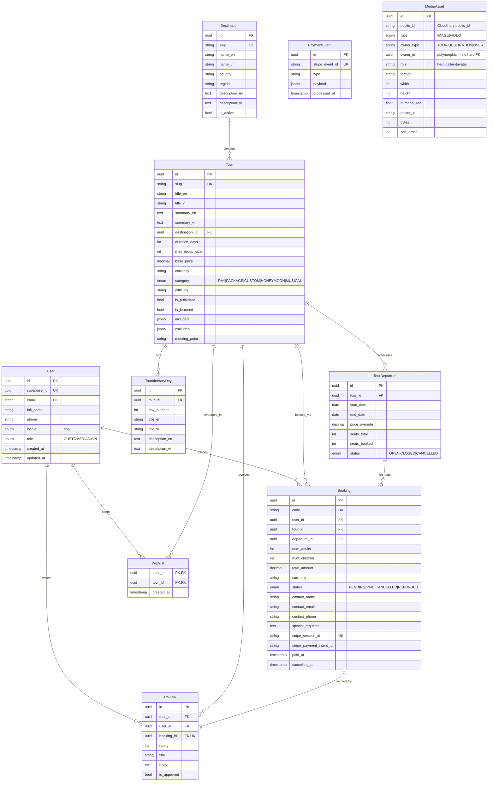

# Tourism API — Entity Relationship Diagram

> Source of truth: [`prisma/schema.prisma`](../../apps/api/prisma/schema.prisma).
> Render with [dbdiagram.io](https://dbdiagram.io) or VS Code Mermaid preview.

## Mermaid ER



> **`MediaAsset` is polymorphic** (`owner_type` + `owner_id`) and has **no
> DB-level FK** to its owner — it is therefore not drawn with a relation edge
> above. Referential integrity + orphan cleanup are enforced in `MediaService`
> inside the same transaction that mutates the owner. Photos/clips live in
> Cloudinary; we store `public_id` and build delivery URLs at read time.

## Indexes (critical)

| Table | Index | Reason |
| --- | --- | --- |
| `tours` | `(slug)` UNIQUE | Public detail lookup |
| `tours` | `(is_published, category)` | Filtered catalog query |
| `tours` | `(destination_id)` | List by destination |
| `tours` | `(is_featured, is_published)` | Home page featured strip (published + featured combo) |
| `tour_departures` | `(tour_id, start_date)` | Upcoming departures of a tour |
| `bookings` | `(user_id, status)` | "My bookings" history |
| `bookings` | `(stripe_session_id)` UNIQUE | Webhook lookup |
| `reviews` | `(tour_id, is_approved)` | Show approved reviews |
| `payment_events` | `(stripe_event_id)` UNIQUE | Webhook idempotency |
| `media_assets` | `(owner_type, owner_id, role)` | Batch-load an owner's media |

## Bilingual content strategy

For every user-facing text on Destination, Tour, and TourItineraryDay we store **both** `*_en` and `*_vi` columns. Frontend selects by `user.locale` or browser preference. No translation table — keeps queries simple, acceptable for 2 languages. If we add ZH later we will refactor to a `translations` join table.

## Migrations

```bash
# Local dev (against direct connection)
pnpm --filter @tourism/api exec prisma migrate dev --name <name>

# Production
pnpm --filter @tourism/api exec prisma migrate deploy
```

`prisma.config.ts` reads `DIRECT_URL` (port 5432) for migration commands;
runtime `PrismaClient` reads `DATABASE_URL` (Supabase pooler, port 6543).

> `migrate dev` refuses to run in a non-interactive shell when a change is
> data-lossy (e.g. dropping a populated column). In that case author the
> `migrations/<ts>_<name>/migration.sql` by hand and apply it with
> `migrate deploy`.
